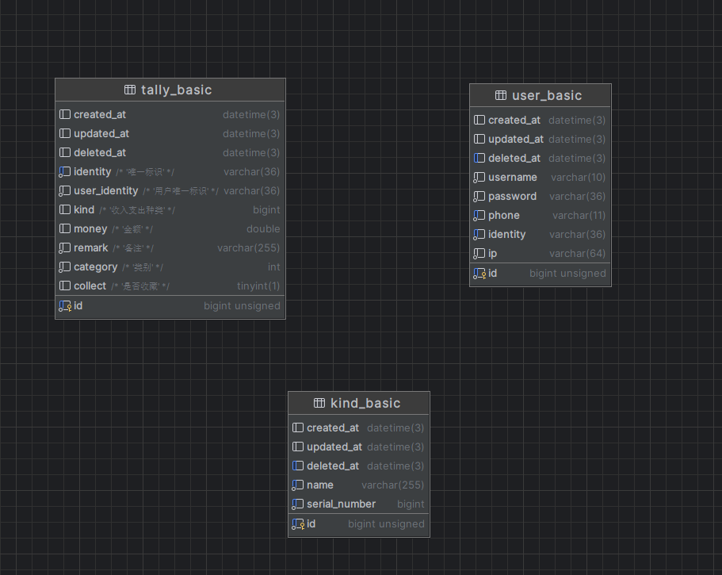

## 使用 echo+gorm+redis实现

### 1 sql语句



### 2 配置文件config,yaml,修改配置

```yaml
#服务器
service:
  port: 80
  name: "1239"

#mysql
mysql:
  username: "root"
  password: "admin123"
  database: "talk"
  url: "127.0.0.1"

#redis
redis:
  addr: ""
  db: 0
  password: ""
  poolsize: 1000
  maxidleconns: 1000
  minidleconns: 10
  connMaxIdleTime: 10

#jwt
jwt:
  time: 12
  key: "welcome to use Tally by Mr.Lei"
  
#日志相关配置
Logs:
  leave: "info"
  prefix: "Tally"
  path: "./log/"
  maxsize: 100

#oauth2验证库
oauth2:
  clientID: ""
  clientSecret: ""
  authURL: ""
  tokenURL: ""
  redirectURL: ""
  scopes: ""

#x星火大模型
sparkDesk:
  appid: ""
  apiSecret: ""
  apiKey: ""
  hostUrl: "wss://spark-api.xf-yun.com/v3.1/chat"
  
#腾讯cos对象存储
tencentCos:
  Url: ""
  secretId: ""
  secretKey: ""


```

### 3 启动服务

#### 1.下载依赖

```shell
go mod tidy
```

#### 2.运行

```shell
go run main.go
```

### 4 api文档
[api接口文档](https://documenter.getpostman.com/view/26266864/2s9Ykhfint)

### 5 命令
```txt
 du -h /root/tally  查看文件夹占用大小
 go build -o talk -ldflags "-s  -w"  打包可执行文件
```


