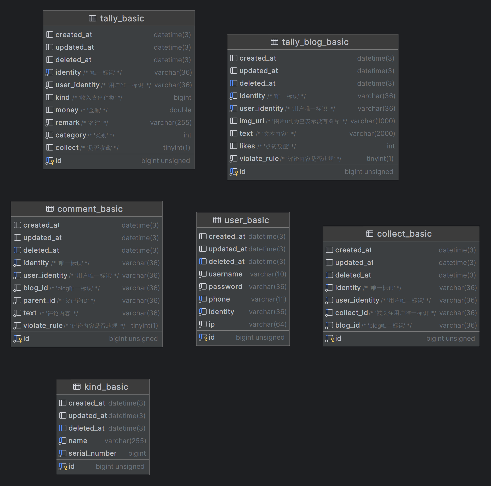

## 使用 echo+gorm+redis实现

### 1 sql语句


### 2 配置文件config,yaml,修改配置
```yaml
service:
  port: 80
  name: "1239"

mysql:
  username: "root"
  password: "admin123"
  database: "talk"
  url: "127.0.0.1"

redis:
  addr: ""
  db: 0
  password: ""
  poolsize: 1000
  maxidleconns: 1000
  minidleconns: 10
  connMaxIdleTime: 10


jwt:
  time: 12  
  key: "welcome to use Tally by Mr.Lei"


```

### 3 启动服务
#### 1.下载依赖
```shell
go mod tidy
```
#### 2.运行
```shell
go run main.go
```


